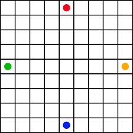

# Quoridor 1.0



___

[Official Game Instructions](https://www.ultraboardgames.com/quoridor/game-rules.php)
___

## Start of game

The game starts once you choose the number of people playing, your unique names, and the symbols to represent yourself.

*Feel free to add more compatible symbol choices:*

```
static ArrayList<Character> symbols = new ArrayList<Character>(java.util.List.of('★', '❋', '✪', '♧', '♥', '●', '◆' // Add stuff here));
```

___

## How to interact with the terminal

● can represent player one and ◆ can represent player two

When it is a player's turn, they will be prompted for all the possible options they can take. These are ways the player can respond:

___

**Word-for-word:**

```
2.) [Move left]

output: left
```

**First letter of action:**

```
1.) [Jump over player right]

output: r
```

**Number assigned to action:**

```
5.) [Place wall (8 left)]

output: 5
```

>**Important note:** Illegal wall placement checking is not implemented in this project's current version. Please don't trap the other player!
